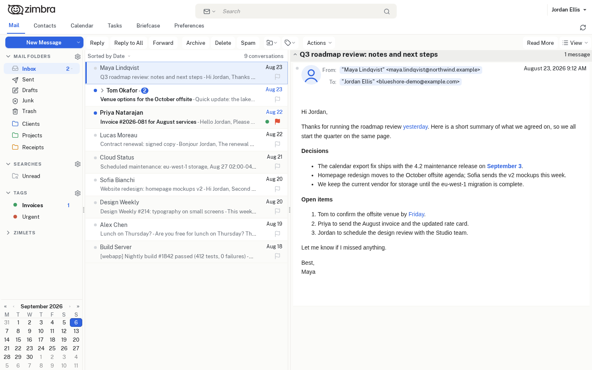
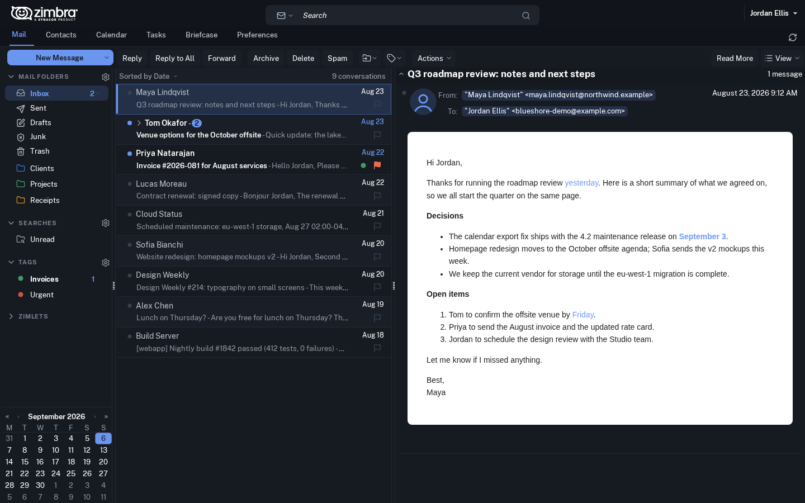
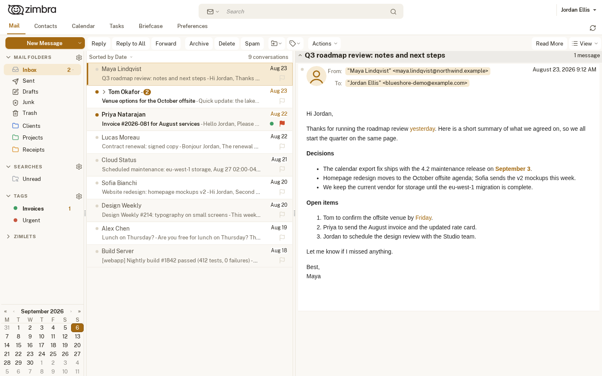
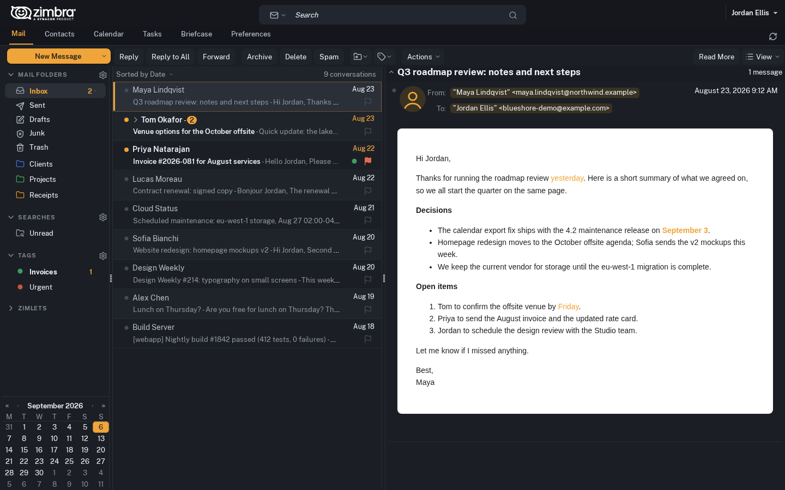

# Blueshore

**Website: <https://eagle1maledetto.github.io/blueshore/>**

A family of four colour-matched skins for the **Zimbra Classic web client**
(Zimbra FOSS 10.x). Same layout, typography and density in every variant;
only the palette changes.

| | Light | Dark |
|---|---|---|
| **Tide** (blue) | `blueshoretide` | `blueshoretidedark` |
| **Sand** (amber) | `blueshoresand` | `blueshoresanddark` |

Each variant is a separate Zimbra skin: users pick one in
*Preferences → General → Theme*, administrators can limit the choice per
class of service or per account. There is no day/night toggle inside the
skin by design.

## Screenshots

| Tide | Tide dark |
|---|---|
|  |  |

| Sand | Sand dark |
|---|---|
|  |  |

More views (calendar, compose) for every variant are in
[`docs/screenshots/`](docs/screenshots/).

## What it changes

- **Flat SVG icons.** Every icon the Classic client can show (folders, tags,
  toolbar actions, message status, calendar, briefcase, preferences pages,
  dialog glyphs, editor buttons) is redrawn with [Lucide](https://lucide.dev)
  icons inlined as data URIs, including hover/focus states and the coloured
  folder/tag composites that Zimbra paints on a canvas. No legacy sprites,
  crisp at any zoom level.
- **Typography.** [Public Sans](https://public-sans.digital.gov/) bundled with
  the skin (no external requests), one coherent scale driven by the user's
  font-size preference, semibold subject on unread rows.
- **Quiet layout.** Neutral warm surfaces, accent colour reserved for
  navigation and selection (app tabs, section headers, selected rows, primary
  button), rounded inputs, compact rows in lists and in the folder tree,
  unread counts split into their own badge.
- **Real dark variants.** Surfaces, message body "card", form controls
  (`color-scheme: dark`), calendar grid, briefcase preview, list selection,
  editor toolbar and the core's yellow warning banners are all handled, not
  just the chrome.
- **No core patches.** Blueshore is a plain skin: `manifest.xml`,
  `skin.properties`, `skin.css`, the generated `icons.css` and a small
  skin-local script (`blueshore.js`) that adds what CSS alone cannot reach. It
  survives Zimbra upgrades like any other skin.

## Requirements

- Zimbra Collaboration FOSS **10.1.x**, Classic (Advanced) web client.
  Developed and tested on 10.1.18; it should work on any 10.1 build that ships
  the `harmony` skin it is derived from.
- Python 3.8+ to build the skins from source (standard library, no
  dependencies). Not needed if you install a prebuilt skin from the
  [releases page](https://github.com/eagle1maledetto/blueshore/releases).

## Install

Prebuilt skins are attached to every
[GitHub release](https://github.com/eagle1maledetto/blueshore/releases), a
zip and a tarball per variant. Short version, as the `zimbra` user on the
mailbox server (full procedure, a root-only alternative, updates, removal and
troubleshooting in [INSTALL.md](INSTALL.md)):

```sh
sudo su - zimbra
VER=1.0.2
SKIN=blueshoretide
zmacl disable
curl -fLo /tmp/$SKIN.zip https://github.com/eagle1maledetto/blueshore/releases/download/v$VER/$SKIN-$VER.zip
zmskindeploy /tmp/$SKIN.zip
zmprov fc skin
zmacl enable
```

Repeat for each variant you want to offer. From a source checkout, build
first (next section) and point `zmskindeploy` at the built directory instead
of the zip (`zmskindeploy /path/to/skins/$SKIN`). Users then find the skin in
*Preferences → General → Theme*, unless their class of service limits the
themes: see *Offer it to users* in INSTALL.md before touching
`zimbraAvailableSkin`.

## How to build

The repository holds the source only: the deployable skins are generated by
`tools/build.py` into `skins/`, which is not tracked in git. Python 3.8+,
standard library, no dependencies:

```sh
git clone https://github.com/eagle1maledetto/blueshore.git
cd blueshore
python3 tools/build.py --all          # every palettes/*.properties -> skins/<SkinName>/
python3 tools/build.py tide sanddark  # or only the variants you want
```

Each `skins/<SkinName>/` is a complete skin, ready to copy into
`/opt/zimbra/jetty_base/webapps/zimbra/skins/` as described in
[INSTALL.md](INSTALL.md). The build is deterministic: the release archives
hold byte for byte what `build.py --all` produces at the tagged commit.

### Make your own variant

A variant is a palette file: `SkinName` plus the colour tokens that differ
from the shared source. Copy `palettes/tide.properties` (it lists every
token), change the values, then:

```sh
python3 tools/build.py mypalette      # -> skins/<SkinName>/
```

Token reference, dark-variant checklist and icon tooling are described in
[docs/CUSTOMIZING.md](docs/CUSTOMIZING.md).

## Repository layout

```
src/blueshore/   shared source: manifest, skin.properties (design tokens),
                 skin.css, blueshore.js, fonts/, licences
palettes/        one .properties per variant (SkinName + overridden tokens)
tools/           build.py (palette -> skin), gen-icons.py (Lucide -> icons.css),
                 skinprops.py, lucide/ (vendored icon subset)
skins/           build output, not tracked in git (see "How to build")
docs/            customisation guide and screenshots
```

Edit `src/` or `palettes/` and rebuild; never edit `skins/` by hand.

## Known limitations

- **Login page** is not themed: in Zimbra 10 it is rendered outside the skin.
- **Theme picker name.** The Preferences page shows the technical skin name
  capitalised ("Blueshoretide"); Zimbra has no display-name field for skins.
- **Domain theme colours override the palette.** If a domain sets
  `zimbraSkinBackgroundColor`, `zimbraSkinForegroundColor`,
  `zimbraSkinSecondaryColor` or `zimbraSkinSelectionColor`, the CSS servlet
  substitutes them into *any* skin and Blueshore surfaces take that colour.
  Clear them on the domain (see INSTALL.md).
- **One logo for light and dark.** `zimbraSkinLogoAppBanner` is a domain
  attribute, so the same image is used by every variant; choose one that
  reads on both backgrounds.
- **Browser cache.** The aggregated CSS is served with a 30-day cache lifetime
  keyed on the Zimbra build, not on the skin files: after updating a skin,
  users may need a hard reload.
- Classic UI only. The Modern UI has its own theming system.

## License

Blueshore is a derivative of the `harmony` skin shipped with Zimbra
Collaboration Suite. Files derived from Zimbra keep their original licence
and headers (CPAL 1.0 for `manifest.xml` and `skin.css`, GPLv2 for
`skin.properties`). The original Blueshore code (`blueshore.js`, `tools/`,
generated files, documentation), Copyright (C) 2026 Gianluca Zamagni,
Parvati Srl, is released under the
**GNU Affero General Public License v3.0 or later**: use it freely, also
commercially and in hosted services, but if you modify it and let users
interact with the result over a network you must offer them your modified
source. The colour palettes in `palettes/` are GPL-2.0-or-later, so that
their values can be merged into Zimbra's GPLv2 `skin.properties`. Icons are
from Lucide (ISC), the typeface is Public Sans (SIL OFL 1.1). Full text in
[LICENSE](LICENSE), file-by-file overview, modifications to the Zimbra files
and how the licences fit together in [NOTICE.md](NOTICE.md).
